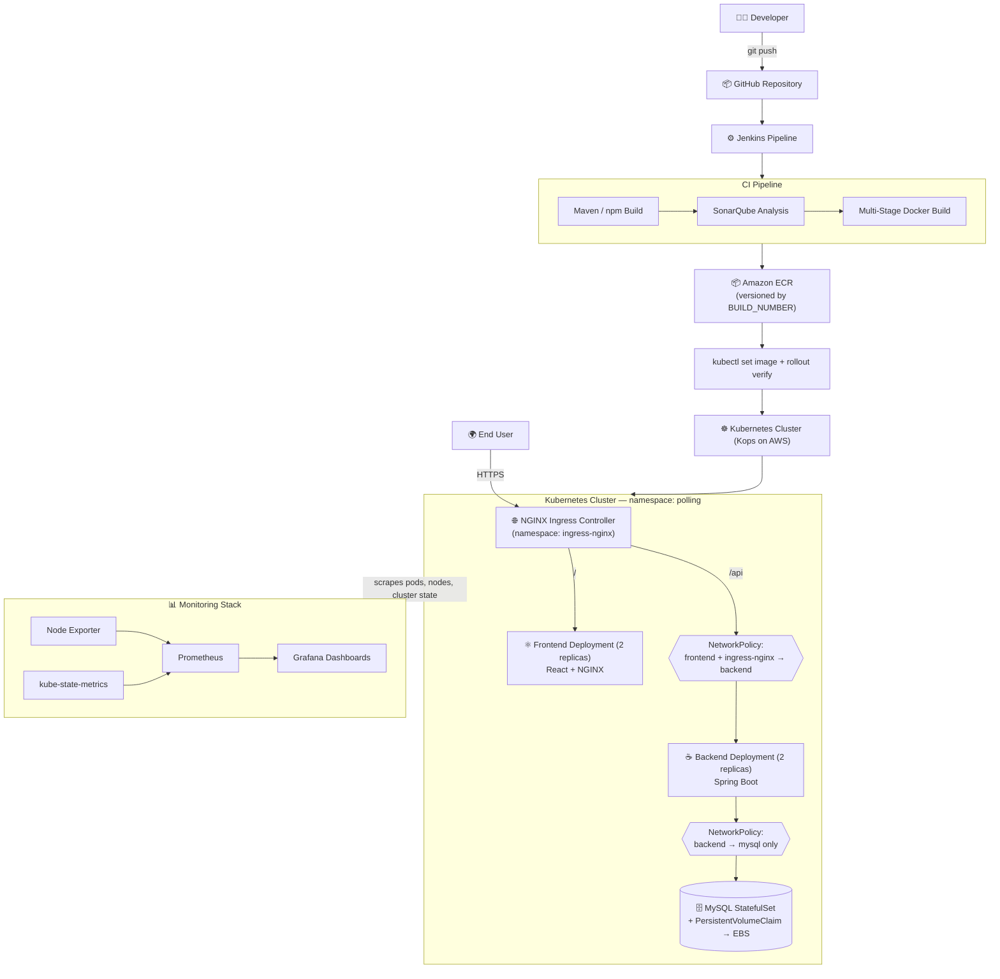

# 🗳️ Polling App — End-to-End DevOps Pipeline on Kubernetes

[](#)
[](#)
[](#)
[-326CE5?logo=kubernetes&logoColor=white)](#)
[](#)
[](#)

A production-style, end-to-end DevOps implementation of a full-stack **Polling Application** — taken from a `git commit` all the way to a **monitored, self-healing, security-hardened** deployment on **Kubernetes**.

This isn't a "deploy a container and call it done" project. It covers CI/CD automation, code quality gates, multi-stage container builds, cluster networking and zero-trust security, stateful storage, full observability, and real, hands-on production troubleshooting.

---

## 📌 Table of Contents

- [Why This Project](#-why-this-project)
- [Architecture](#-architecture)
- [Tech Stack](#-tech-stack)
- [Repository Structure](#-repository-structure)
- [Containerization Strategy](#-containerization-strategy)
- [CI/CD Pipeline](#-cicd-pipeline)
- [Kubernetes Deployment — Design & Reasoning](#-kubernetes-deployment--design--reasoning)
- [Security](#-security)
- [Monitoring & Observability](#-monitoring--observability)
- [Real-World Troubleshooting](#-real-world-troubleshooting)
- [Screenshots](#-screenshots)
- [Future Enhancements](#-future-enhancements)
- [Key Takeaways](#-key-takeaways)

---

## 💡 Why This Project

Most portfolio DevOps projects stop at "I deployed an app to Kubernetes." This one goes further — it demonstrates the full lifecycle a real platform/DevOps engineer owns, and every design choice below is backed by a reason, not just a default.

| Capability | Demonstrated |
|---|---|
| Automate builds & quality gates | ✅ Jenkins + SonarQube |
| Ship secure, minimal containers | ✅ Multi-stage builds, non-root users, Alpine base images |
| Orchestrate a real multi-tier app | ✅ Kubernetes (Kops), StatefulSet + PVC for MySQL |
| Enforce zero-trust networking | ✅ NetworkPolicies, namespace-aware Ingress routing |
| See inside the system | ✅ Prometheus + Grafana, full cluster observability |
| Debug it like production | ✅ Documented real incidents — not staged screenshots |

---

## 🏗️ Architecture



### Request Flow (Runtime)


### Deployment Flow (CI/CD)

```
Developer → GitHub → Jenkins → Maven/npm Build → SonarQube Analysis
→ Docker Multi-Stage Build → Amazon ECR (versioned by BUILD_NUMBER)
→ kubectl set image → kubectl rollout status → Live in Production
```

---

## 🧰 Tech Stack

| Category | Tools |
|---|---|
| **Cloud** | AWS EC2, Amazon ECR |
| **Source Control** | GitHub |
| **CI/CD** | Jenkins (Declarative Pipeline) |
| **Code Quality** | SonarQube (Maven plugin + Sonar Scanner CLI) |
| **Containerization** | Docker, Docker Compose, Multi-Stage Builds |
| **Orchestration** | Kubernetes (provisioned via Kops on AWS) |
| **Networking** | NGINX Ingress Controller, ClusterIP Services, NetworkPolicies |
| **Monitoring** | Prometheus, Grafana, Node Exporter, kube-state-metrics |
| **Application** | React, Spring Boot (Java 11), MySQL 8 |

---

## 📁 Repository Structure

```
polling-devops-k8s/
│
├── application_code/
│   ├── polling-app-client/       # React frontend
│   ├── polling-app-server/       # Spring Boot backend
│   └── docker-compose.yml
│
├── k8s/
│   ├── backend-deployment.yaml
│   ├── frontend-deployment.yaml
│   ├── mysql-statefulset.yaml
│   ├── services/
│   ├── ingress/
│   ├── configmaps/
│   ├── secrets/
│   ├── pvc/
│   └── network-policies/
│
├── monitoring/
│   ├── prometheus/
│   └── grafana/
│
├── screenshots/
├── Jenkinsfile
└── README.md
```

---

## 🐳 Containerization Strategy

Both services use **multi-stage Docker builds** — separating build-time dependencies from what actually ships, to keep runtime images small, fast, and secure.

### Frontend — `polling-app-client`

| Stage | Base Image | Responsibility |
|---|---|---|
| Build | `node:12.4.0-alpine` | Install dependencies, build production React assets |
| Runtime | `nginx:1.17.0-alpine` | Serve static build output, act as reverse proxy |

```dockerfile
ARG REACT_APP_API_BASE_URL
ENV REACT_APP_API_BASE_URL=${REACT_APP_API_BASE_URL}
RUN npm install && npm run build

COPY --from=build /app/build /var/www
COPY nginx.conf /etc/nginx/nginx.conf
```

> Since React compiles to static files, this URL is baked in at **build time**, not runtime — a deliberate trade-off. The backend, by contrast, reads its config at container startup (below), which is why the same backend image can be promoted across environments without a rebuild, while the frontend cannot.

### Backend — `polling-app-server`

| Stage | Base Image | Responsibility |
|---|---|---|
| Build | `maven:3.9.6-eclipse-temurin-11` | Resolve dependencies, package executable JAR |
| Runtime | `eclipse-temurin:11-jre-alpine` | Run the packaged application |

```dockerfile
RUN mvn dependency:go-offline
RUN mvn clean package -DskipTests

RUN addgroup -S devops && adduser -S appuser -G devops
USER appuser
COPY --from=builder /build/target/*.jar webapp.jar
ENTRYPOINT ["java","-jar","webapp.jar"]
```

> 🔐 Runs as a **dedicated non-root user**, limiting blast radius if the container is ever compromised. Database credentials are injected as environment variables at container **startup**, not baked into the image — the same image runs unmodified across dev, staging, and prod.

**Image Versioning:** every image is tagged with the Jenkins `BUILD_NUMBER` (e.g. `polling-app-server:47`) — enabling traceable, instantly-rollback-able deployments and avoiding stale-image bugs (see [Troubleshooting #2](#-real-world-troubleshooting)).

---

## 🔄 CI/CD Pipeline

```
Fetch Code → Build → SonarQube Analysis → Docker Build
→ Push to Amazon ECR → Deploy to Kubernetes → Verify Rollout
```

| Stage | What Happens |
|---|---|
| **Fetch Code** | Clones the `main` branch from GitHub |
| **Build** | `mvn install -DskipTests`, packages the Spring Boot JAR |
| **SonarQube Analysis** | Backend via Maven Sonar plugin; frontend via Sonar Scanner CLI — bugs, vulnerabilities, code smells, maintainability |
| **Docker Build** | `docker compose build` produces frontend and backend images |
| **Push to ECR** | AWS auth, Docker login, versioned image push |
| **Deploy to Kubernetes** | `kubectl set image deployment/backend` / `deployment/frontend` |
| **Verify Rollout** | `kubectl rollout status` — the pipeline fails loudly if the rollout doesn't complete healthily, rather than reporting a false success |

---

## ☸️ Kubernetes Deployment — Design & Reasoning

Provisioned on AWS via **Kops**, isolated inside a dedicated `polling` namespace. Every object below exists for a specific reason — not just because it's "the Kubernetes way."

### How self-healing actually works

A **Deployment** doesn't manage Pods directly — it manages a **ReplicaSet**, whose only job is to continuously enforce a desired Pod count. Kubernetes' control plane runs this as a permanent reconciliation loop: it compares *desired state* (from the Deployment spec) against *actual state* (what's really running), and if a Pod dies — crash, node failure, manual deletion — the ReplicaSet detects the gap and creates a replacement automatically, with no manual intervention. This is the literal mechanism behind "self-healing," not a magic label.

### Frontend & Backend Deployments

| | Frontend | Backend |
|---|---|---|
| Replicas | 2 | 2 |
| Resources | `100m–250m` CPU / `128Mi–256Mi` mem | `250m–500m` CPU / `512Mi–1Gi` mem |
| Config | — | ConfigMap + Secret via `envFrom` |
| Probes | Readiness + Liveness | Readiness + Liveness on `/api/polls` |

**Requests vs. Limits, precisely:** the *request* is what the Scheduler uses to decide which node has room for the Pod — a guarantee, not a cap. The *limit* is the hard ceiling. What happens at that ceiling differs by resource: a **CPU** limit throttles the container (it keeps running, just slower — CPU time is compressible). A **memory** limit gets the container **OOMKilled** outright, since memory isn't compressible — there's nothing to throttle. This is visible directly via `kubectl describe pod` → `Last State: OOMKilled`, exit code `137` — the same underlying SIGKILL mechanism as a Docker-level OOM, just enforced by Kubernetes cgroups instead of the host kernel.

**Readiness vs. Liveness — two different failure responses, not two names for the same check:**
- A failed **readiness** probe removes the Pod from the Service's Endpoints list — traffic simply stops being routed to it. The container itself is untouched; it's a "don't send this Pod work right now" signal, not a punishment.
- A failed **liveness** probe causes Kubernetes to **kill and restart the container** inside the same Pod — this assumes the process is genuinely stuck or deadlocked, not just temporarily busy.
- Using the same aggressive threshold for both is a real, common misconfiguration: a slow-starting app can get killed by liveness before it ever passes readiness, restart after restart, in a permanent crash loop. This is why `initialDelaySeconds` on liveness is deliberately longer than on readiness — liveness needs to give the app real room to finish starting before assuming it's broken.

**Rolling updates, and how they connect back to the pipeline above:** a new image version doesn't replace all Pods at once — Kubernetes creates a **new ReplicaSet** and gradually scales it up while scaling the old one down, governed by `maxSurge` (how many extra Pods can temporarily exist) and `maxUnavailable` (how many can be down at once). Critically, **a new Pod only counts as available once it passes its readiness probe** — not just once the container starts. If a bad deploy never passes readiness, the rollout **stalls** rather than silently completing with broken Pods live. This is exactly what the `kubectl rollout status` step in the Jenkins pipeline is watching for — a rollout that hangs there is a real, actionable signal, not a flake.

### MySQL — why a StatefulSet, not a Deployment

A Deployment's replacement Pods get a **new random name and a completely fresh, empty filesystem** — fine for stateless apps, catastrophic for a database. A **StatefulSet** provides two guarantees a Deployment doesn't:

1. **Stable, predictable identity** — the Pod is always named `mysql-0`, even after being deleted and recreated. No random suffixes.
2. **Storage tied to that identity, not the Pod's lifecycle** — each StatefulSet Pod gets a dedicated **PersistentVolumeClaim (PVC)**, a *request* for storage that stays bound to the same underlying **PersistentVolume (PV)** — backed by an actual AWS **EBS volume** — across Pod recreation. When `mysql-0` is deleted and recreated, the new Pod reattaches to the *exact same* PVC, not a fresh empty one. That's the actual mechanism preventing data loss on restart — verified directly on this project by deleting the MySQL Pod and confirming pre-existing data was still present afterward.

**The real failure mode to know:** deleting the *Pod* is safe (proven above). Deleting the *PVC itself* is not — that would release the underlying volume, and any new Pod would bind to a fresh, empty claim. Pod-level resilience and storage-level resilience are two different guarantees.

### Networking model — Services, Ingress, and the default-allow trap

**Services** (all `ClusterIP` here — internal-only by design, since nothing except the Ingress Controller needs to be internet-facing) find their target Pods purely through **label selectors**, tracked as a live **Endpoints** list. This match is silent on failure: a selector/label mismatch doesn't throw an error anywhere — the Service just ends up with zero Endpoints, and traffic goes nowhere with no direct signal pointing at the cause. `kubectl get endpoints` is the first thing to check when a Service "isn't working."

**Ingress is two separate things people conflate:** the `Ingress` resource is just routing *configuration* (path → Service rules) — it does nothing on its own. The **NGINX Ingress Controller** is the actual running Pod that enforces those rules, and it's the *only* internet-facing component in this architecture; everything behind it stays `ClusterIP`.

**A critical, non-obvious default:** Kubernetes networking is **flat and open by default** — any Pod can reach any other Pod across any namespace unless a `NetworkPolicy` explicitly restricts it. **Namespaces organize and scope resources; they do not, by themselves, provide network isolation** — that's a common misconception worth stating precisely. The moment a `NetworkPolicy` targets a Pod for ingress, that Pod becomes **default-deny** for anything not explicitly allowed — this exact mechanic is what caused, and later fixed, the incident below.

---

## 🔐 Security

- **ConfigMaps & Secrets** externalize all configuration — zero hardcoded credentials in source or manifests. (Worth being precise: Kubernetes Secrets are base64-**encoded**, not encrypted, by default — the real value is decoupling config from code and enabling separate RBAC, not cryptographic security on its own. A more hardened setup would layer in Sealed Secrets or AWS Secrets Manager.)
- **NetworkPolicies enforce zero-trust, default-deny**: backend only accepts traffic from frontend Pods **and** the `ingress-nginx` namespace; MySQL only accepts traffic from backend Pods
- **Non-root container execution** for the backend
- **Namespace isolation** for organizational scoping (explicitly not relied on for network isolation — see above)
- **Least-privilege image design** — multi-stage builds mean the runtime image ships no build tools, compilers, or source code

---

## 📊 Monitoring & Observability

| Component | Role |
|---|---|
| **Prometheus** | Scrapes and stores time-series metrics from pods, nodes, and the cluster itself |
| **Grafana** | Visual dashboards built on Prometheus data — cluster health at a glance |
| **Node Exporter** | Host-level metrics (CPU, memory, disk, network) per node |
| **kube-state-metrics** | Exposes the *state* of Kubernetes objects (Deployments, Pods, PVCs) as metrics |

**Tracked metrics:** CPU & memory usage, disk utilization, network traffic, Pod/Node health, Deployment rollout status, and restart counts — the same signals that would surface issues like an `OOMKilled` Pod or a stalled rollout in real time, rather than only being discovered from user reports.

---

## 🛠️ Real-World Troubleshooting

Genuine production-style debugging — not staged issues written for a portfolio.

### 1. HTTP 504 Gateway Timeout on Login/Signup
**Symptom:** Auth endpoints returned `504 Gateway Timeout` externally.
**Investigation:** Verified Pods, Services, and Endpoints were healthy; confirmed MySQL connectivity; tested the API **directly inside the backend Pod**, where it worked correctly — isolating the fault to the network path, not the application.
**Root Cause:** The backend `NetworkPolicy` only allowed ingress from Pods labeled `app: frontend`. Once applied, the backend became default-deny for everything else — including the NGINX Ingress Controller, which runs as its own Pod in the separate `ingress-nginx` namespace and never matched that selector.
**Fix:** Added a `namespaceSelector` entry (`kubernetes.io/metadata.name: ingress-nginx`) alongside the existing Pod selector — evaluated as a logical OR, so traffic from either source is now permitted.
**Result:** Restored external login/signup without loosening security elsewhere.

### 2. Silent Stale Deployments
**Symptom:** New code changes weren't appearing after a "successful" Jenkins deployment.
**Root Cause:** Static image tags meant Kubernetes saw no change in the Pod spec and had nothing to roll out — the old container kept running, and the rollout reported success with nothing having actually changed.
**Fix:** Switched to Jenkins `BUILD_NUMBER`-based image tagging for every build.
**Result:** Every deployment now produces a unique, traceable, instantly rollback-able image version.

### 3. Docker Build Failure — Out of Memory (Exit Code 137)
**Symptom:** `npm install` was forcibly killed mid-build with exit code 137.
**Investigation:** Diagnosed via `dmesg` and `free -h` — confirmed the Linux OOM killer terminated the process due to insufficient memory on a small build instance.
**Fix:** Added swap space as an immediate fix; identified upgrading the build instance as the correct long-term one.
**Result:** Directly connects to how Kubernetes handles the same failure mode at the Pod level (`OOMKilled`) — same root mechanism, different enforcement layer.

### 4. Disk Exhaustion Mid-Build
**Symptom:** A Docker build failed with `no space left on device`.
**Investigation:** Confirmed via `df -h`; used `docker system df` to identify unused images, stopped containers, and build cache as the cause.
**Fix:** Cleaned up with `docker system prune`, carefully excluding volumes to avoid wiping the MySQL database.
**Result:** Recovered with zero data loss; established a routine cleanup habit for the build environment.

### 5. Kubernetes Admin Access Lost
**Symptom:** `kubectl` stopped authenticating against the cluster.
**Fix:** Re-exported cluster credentials with `kops export kubecfg --admin`.
**Result:** Cluster administration access restored with zero workload downtime.

---

## 📸 Screenshots

> Add screenshots to the `screenshots/` folder and link them below.

| | |
|---|---|
| Jenkins Pipeline | `screenshots/jenkins-pipeline.png` |
| SonarQube Analysis | `screenshots/sonar-analysis.png` |
| Amazon ECR Repositories | `screenshots/ecr-repos.png` |
| Kubernetes Pods & Services | `screenshots/k8s-resources.png` |
| Grafana Dashboard | `screenshots/grafana-dashboard.png` |
| Application Home Page | `screenshots/app-home.png` |

---

## 🔮 Future Enhancements

- [ ] Migrate manifests to **Helm Charts**
- [ ] Implement **GitOps** with ArgoCD
- [ ] Provision infrastructure using **Terraform**
- [ ] Migrate the cluster to **Amazon EKS**
- [ ] Centralized logging with **Loki** or the **ELK Stack**
- [ ] **Horizontal Pod Autoscaling** driven by custom metrics
- [ ] Integrate security scanning (image + IaC) into CI/CD
- [ ] **Blue-green** deployment strategy
- [ ] Automated disaster recovery & backup strategy

---

## ✅ Key Takeaways

This project demonstrates a genuinely production-shaped DevOps workflow — from a `git push` to a monitored, self-healing Kubernetes deployment — covering CI/CD automation, containerization, image lifecycle management, cluster networking and security, persistent storage, full observability, and hands-on incident troubleshooting using **AWS, Jenkins, Docker, Amazon ECR, Kubernetes, Prometheus, Grafana, SonarQube, React, Spring Boot,** and **MySQL**.

---

<p align="center">Built as an end-to-end demonstration of modern DevOps and Kubernetes practices.</p>
