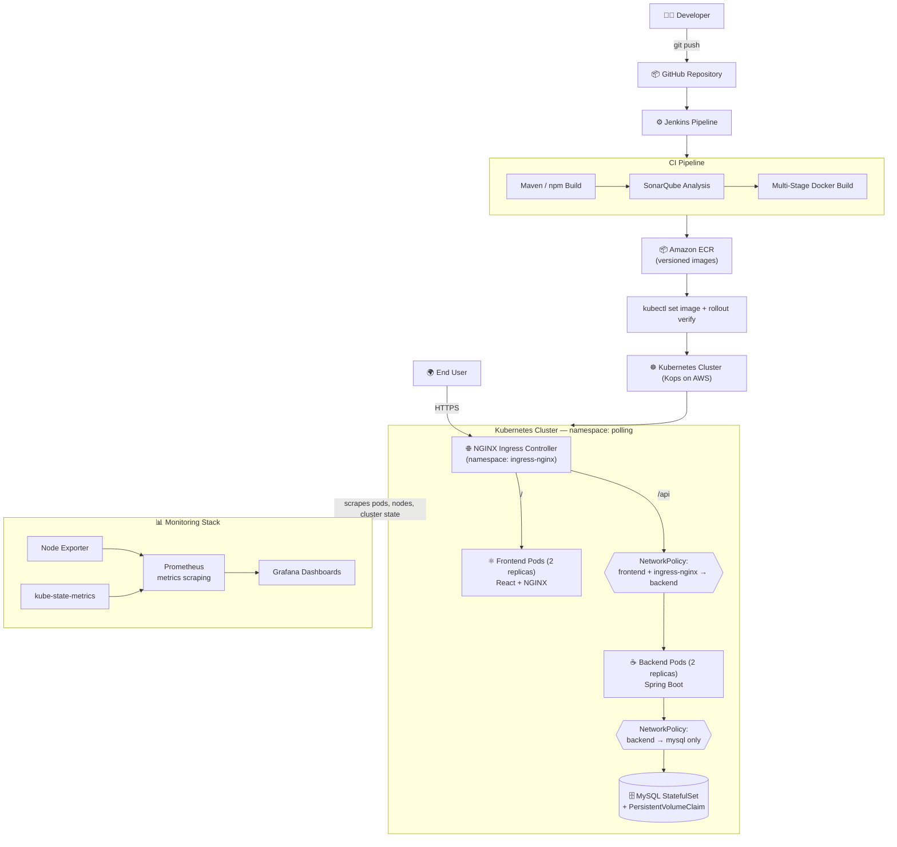
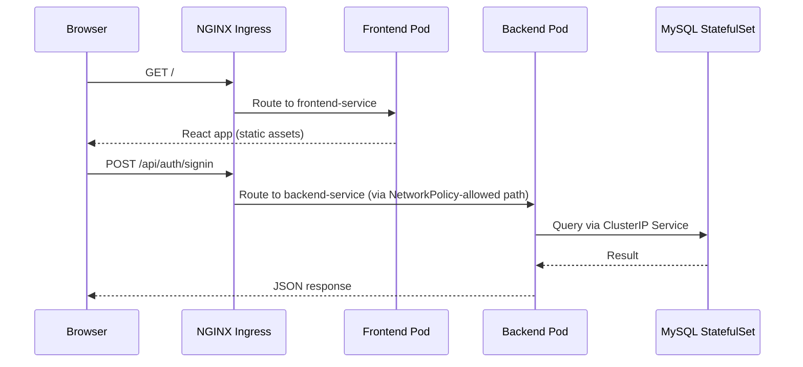

# 🗳️ Polling App — End-to-End DevOps Pipeline on Kubernetes

[](#)
[](#)
[](#)
[-326CE5?logo=kubernetes&logoColor=white)](#)
[](#)
[](#)

A production-style, end-to-end DevOps implementation of a full-stack **Polling Application** — taken from a `git commit` all the way to a **monitored, self-healing, security-hardened** deployment on **Kubernetes**.

This isn't a "deploy a container and call it done" project. It's a complete pipeline covering CI/CD automation, code quality gates, multi-stage container builds, cluster networking and zero-trust security, persistent stateful storage, full observability, and — most importantly — **real, hands-on production troubleshooting**, not just a tutorial checklist.

---

## 📌 Table of Contents

- [Why This Project](#-why-this-project)
- [Architecture](#-architecture)
- [Tech Stack](#-tech-stack)
- [Repository Structure](#-repository-structure)
- [Containerization Strategy](#-containerization-strategy)
- [CI/CD Pipeline](#-cicd-pipeline)
- [Kubernetes Deployment](#-kubernetes-deployment)
- [Security](#-security)
- [Monitoring & Observability](#-monitoring--observability)
- [Real-World Troubleshooting](#-real-world-troubleshooting)
- [Screenshots](#-screenshots)
- [Future Enhancements](#-future-enhancements)
- [Key Takeaways](#-key-takeaways)

---

## 💡 Why This Project

Most portfolio DevOps projects stop at "I deployed an app to Kubernetes." This one goes further — it demonstrates the full lifecycle a real platform/DevOps engineer owns:

| Capability | Demonstrated |
|---|---|
| Automate builds & quality gates | ✅ Jenkins + SonarQube |
| Ship secure, minimal containers | ✅ Multi-stage builds, non-root users, Alpine base images |
| Orchestrate a real multi-tier app | ✅ Kubernetes (Kops), StatefulSet + PVC for MySQL |
| Enforce zero-trust networking | ✅ NetworkPolicies, namespace-aware Ingress routing |
| See inside the system | ✅ Prometheus + Grafana, full cluster observability |
| Debug it like production | ✅ Documented real incidents — not staged screenshots |

---

## 🏗️ Architecture



### Request Flow (Runtime)



### Deployment Flow (CI/CD)

```
Developer → GitHub → Jenkins → Maven/npm Build → SonarQube Analysis
→ Docker Multi-Stage Build → Amazon ECR (versioned by BUILD_NUMBER)
→ kubectl set image → kubectl rollout status → Live in Production
```

---

## 🧰 Tech Stack

| Category | Tools |
|---|---|
| **Cloud** | AWS EC2, Amazon ECR |
| **Source Control** | GitHub |
| **CI/CD** | Jenkins (Declarative Pipeline) |
| **Code Quality** | SonarQube (Maven plugin + Sonar Scanner CLI) |
| **Containerization** | Docker, Docker Compose, Multi-Stage Builds |
| **Orchestration** | Kubernetes (provisioned via Kops on AWS) |
| **Networking** | NGINX Ingress Controller, ClusterIP Services, NetworkPolicies |
| **Monitoring** | Prometheus, Grafana, Node Exporter, kube-state-metrics |
| **Application** | React, Spring Boot (Java 11), MySQL 8 |

---

## 📁 Repository Structure

```
polling-devops-k8s/
│
├── application_code/
│   ├── polling-app-client/       # React frontend
│   ├── polling-app-server/       # Spring Boot backend
│   └── docker-compose.yml
│
├── k8s/
│   ├── backend-deployment.yaml
│   ├── frontend-deployment.yaml
│   ├── mysql-statefulset.yaml
│   ├── services/
│   ├── ingress/
│   ├── configmaps/
│   ├── secrets/
│   ├── pvc/
│   └── network-policies/
│
├── monitoring/
│   ├── prometheus/                # Prometheus config, scrape targets
│   └── grafana/                   # Dashboard JSON definitions
│
├── screenshots/
├── Jenkinsfile
└── README.md
```

---

## 🐳 Containerization Strategy

Both services use **multi-stage Docker builds** — separating build-time dependencies from what actually ships, to keep runtime images small, fast, and secure.

### Frontend — `polling-app-client`

| Stage | Base Image | Responsibility |
|---|---|---|
| Build | `node:12.4.0-alpine` | Install dependencies, build production React assets |
| Runtime | `nginx:1.17.0-alpine` | Serve static build output, act as reverse proxy |

```dockerfile
ARG REACT_APP_API_BASE_URL
ENV REACT_APP_API_BASE_URL=${REACT_APP_API_BASE_URL}
RUN npm install && npm run build

COPY --from=build /app/build /var/www
COPY nginx.conf /etc/nginx/nginx.conf
```

### Backend — `polling-app-server`

| Stage | Base Image | Responsibility |
|---|---|---|
| Build | `maven:3.9.6-eclipse-temurin-11` | Resolve dependencies, package executable JAR |
| Runtime | `eclipse-temurin:11-jre-alpine` | Run the packaged application |

```dockerfile
RUN mvn dependency:go-offline
RUN mvn clean package -DskipTests

RUN addgroup -S devops && adduser -S appuser -G devops
USER appuser
COPY --from=builder /build/target/*.jar webapp.jar
ENTRYPOINT ["java","-jar","webapp.jar"]
```

> 🔐 The backend runs as a **dedicated non-root user**, limiting blast radius in the event of a container compromise.

**Image Versioning:** every image is tagged with the Jenkins `BUILD_NUMBER` (e.g. `polling-app-server:47`) — enabling traceable, instantly-rollback-able deployments and avoiding stale-image bugs.

---

## 🔄 CI/CD Pipeline

```
Fetch Code → Build → SonarQube Analysis → Docker Build
→ Push to Amazon ECR → Deploy to Kubernetes → Verify Rollout
```

| Stage | What Happens |
|---|---|
| **Fetch Code** | Clones the `main` branch from GitHub |
| **Build** | `mvn install -DskipTests`, packages the Spring Boot JAR |
| **SonarQube Analysis** | Backend via Maven Sonar plugin; frontend via Sonar Scanner CLI — bugs, vulnerabilities, code smells, maintainability |
| **Docker Build** | `docker compose build` produces frontend and backend images |
| **Push to ECR** | AWS auth, Docker login, versioned image push |
| **Deploy to Kubernetes** | `kubectl set image deployment/backend` / `deployment/frontend` |
| **Verify Rollout** | `kubectl rollout status` — pipeline fails loudly if the rollout doesn't complete healthily |

---

## ☸️ Kubernetes Deployment

Provisioned on AWS via **Kops**, isolated inside a dedicated `polling` namespace.

### Frontend Deployment
2 replicas · Rolling updates · Readiness/liveness probes · `100m–250m` CPU / `128Mi–256Mi` memory

### Backend Deployment
2 replicas · Self-healing · ConfigMap + Secret injection via `envFrom` · Probes on `/api/polls` · `250m–500m` CPU / `512Mi–1Gi` memory

### MySQL StatefulSet
MySQL 8 · Stable network identity · Data persisted via a **PersistentVolumeClaim** mounted at `/var/lib/mysql` — survives Pod deletion/recreation, unlike a stateless Deployment

### Services & Ingress

| Service | Type | Port |
|---|---|---|
| Frontend | ClusterIP | 80 |
| Backend | ClusterIP | 80 → 8080 |
| MySQL | ClusterIP | 3306 |

| Ingress Path | Routes To |
|---|---|
| `/` | `frontend-service` |
| `/api` | `backend-service` |

---

## 🔐 Security

- **ConfigMaps & Secrets** externalize all configuration — zero hardcoded credentials in source or manifests
- **NetworkPolicies enforce zero-trust**: backend only accepts traffic from frontend Pods **and** the `ingress-nginx` namespace; MySQL only accepts traffic from backend Pods
- **Non-root container execution** for the backend
- **Namespace isolation** for the full application stack
- **Least-privilege image design** — multi-stage builds mean the runtime image ships no build tools, compilers, or source code

---

## 📊 Monitoring & Observability

A full observability stack runs alongside the application — not bolted on as an afterthought:

| Component | Role |
|---|---|
| **Prometheus** | Scrapes and stores time-series metrics from pods, nodes, and the cluster itself |
| **Grafana** | Visual dashboards built on top of Prometheus data — cluster health at a glance |
| **Node Exporter** | Exposes host-level metrics (CPU, memory, disk, network) per node |
| **kube-state-metrics** | Exposes the *state* of Kubernetes objects (Deployments, Pods, PVCs) as metrics |

**Tracked metrics:** CPU & memory usage, disk utilization, network traffic, Pod/Node health, Deployment rollout status, restart counts, and overall cluster resource consumption — the same signals used throughout the troubleshooting below (e.g. spotting `OOMKilled` events, tracking restart counts during a bad rollout).

---

## 🛠️ Real-World Troubleshooting

This project involved genuine production-style debugging — not staged issues written for a portfolio. A few of the most instructive:

### 1. HTTP 504 Gateway Timeout on Login/Signup
**Symptom:** Auth endpoints returned `504 Gateway Timeout` externally.
**Investigation:** Verified pods, Services, and Endpoints were healthy; confirmed MySQL connectivity; tested the API **directly inside the backend pod**, where it worked correctly — proving the application itself was healthy and isolating the fault to the network path.
**Root Cause:** The backend `NetworkPolicy` only allowed traffic from frontend Pods — traffic from the `ingress-nginx` namespace (where real external requests actually originate) was silently dropped.
**Fix:** Added a `namespaceSelector` for `ingress-nginx` to the backend NetworkPolicy.
**Result:** Restored external login/signup without loosening security elsewhere.

### 2. Silent Stale Deployments
**Symptom:** New code changes weren't appearing after a "successful" Jenkins deployment.
**Root Cause:** Static image tags meant Kubernetes saw no change in the Pod spec and had nothing to roll out — the old container kept running.
**Fix:** Switched to Jenkins `BUILD_NUMBER`-based image tagging for every build.
**Result:** Every deployment now produces a unique, traceable, instantly rollback-able image version.

### 3. Docker Build Failure — Out of Memory (Exit Code 137)
**Symptom:** `npm install` was forcibly killed mid-build with exit code 137.
**Investigation:** Diagnosed via `dmesg` and `free -h` — confirmed the Linux OOM killer terminated the process due to insufficient memory on a small build instance.
**Fix:** Added swap space as an immediate fix; noted upgrading the build instance size as the correct long-term fix.
**Result:** Connected this directly to how Kubernetes handles the same failure mode at the Pod level (`OOMKilled`, same underlying SIGKILL mechanism) — same root cause, different enforcement layer.

### 4. Disk Exhaustion Mid-Build
**Symptom:** A Docker build failed with `no space left on device`.
**Investigation:** Confirmed via `df -h`; used `docker system df` to identify unused images, stopped containers, and build cache as the cause.
**Fix:** Cleaned up with `docker system prune`, carefully excluding volumes to avoid wiping the MySQL database.
**Result:** Recovered without any data loss, and established a routine cleanup habit for the build environment.

### 5. Kubernetes Admin Access Lost
**Symptom:** `kubectl` stopped authenticating against the cluster.
**Fix:** Re-exported cluster credentials with `kops export kubecfg --admin`.
**Result:** Cluster administration access restored with zero workload downtime.

---

## 📸 Screenshots

> Add screenshots to the `screenshots/` folder and link them below.

| | |
|---|---|
| Jenkins Pipeline | `screenshots/jenkins-pipeline.png` |
| SonarQube Analysis | `screenshots/sonar-analysis.png` |
| Amazon ECR Repositories | `screenshots/ecr-repos.png` |
| Kubernetes Pods & Services | `screenshots/k8s-resources.png` |
| Grafana Dashboard | `screenshots/grafana-dashboard.png` |
| Application Home Page | `screenshots/app-home.png` |

---

## 🔮 Future Enhancements

- [ ] Migrate manifests to **Helm Charts**
- [ ] Implement **GitOps** with ArgoCD
- [ ] Provision infrastructure using **Terraform**
- [ ] Migrate the cluster to **Amazon EKS**
- [ ] Centralized logging with **Loki** or the **ELK Stack**
- [ ] **Horizontal Pod Autoscaling** driven by custom metrics
- [ ] Integrate security scanning (image + IaC) into CI/CD
- [ ] **Blue-green** deployment strategy
- [ ] Automated disaster recovery & backup strategy

---

## ✅ Key Takeaways

This project demonstrates a genuinely production-shaped DevOps workflow — from a `git push` to a monitored, self-healing Kubernetes deployment — covering CI/CD automation, containerization, image lifecycle management, cluster networking and security, persistent storage, full observability, and hands-on incident troubleshooting using **AWS, Jenkins, Docker, Amazon ECR, Kubernetes, Prometheus, Grafana, SonarQube, React, Spring Boot,** and **MySQL**.

---

<p align="center">Built as an end-to-end demonstration of modern DevOps and Kubernetes practices.</p>
